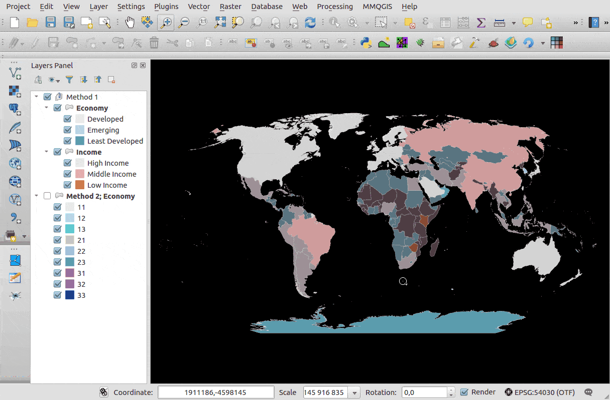

# QGis bivariate legend

## Purpose

This plugin enable generation of legend for bivariate analysis.

You can see it in action with this below screencast.

## Warning

It's an early version. We planned to manage below issues:

* manage borders colors. We encountered some issues in our tests
* catch every uses cases the plugin was not intended for, in particular related to "right" `rendererv2` types.
* manage `"Rule-based"` analysis (hence, only use `"Graduated"` or `"categorized"` analysis)

## Installation

You just need to install it by downloading the zip file or by adding the plugin.xml as an external plugin through the plugin manager.

